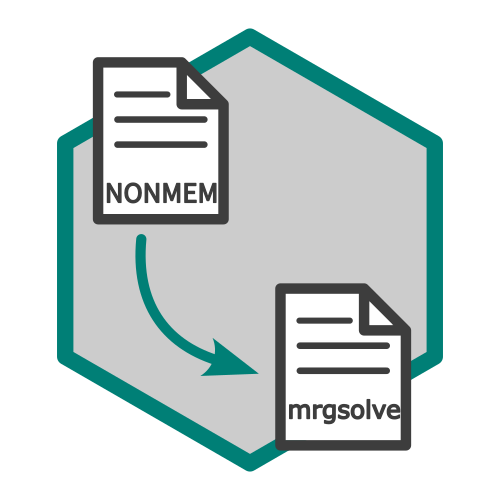

# NONMEM から mrgsolve モデルへの変換ツール

[English](README.md) | 日本語



このパッケージは、NONMEM モデルファイル（`.mod`）を mrgsolve モデルファイル（`.cpp`）へ変換する関数を提供します。NONMEM のモデルファイルを読み取り、対応する mrgsolve のモデルファイルを生成することで、NONMEM モデルを mrgsolve フレームワークへ容易に組み込めるようにします。

## インストール

``` r
pak::pak("RyotaJin/nm2mrg")
```

## 使い方

このパッケージでは、以下のようなディレクトリ構成を想定しています。

```         
root
├── run001.mod
├── run001.ext
├── run001.lst
└── ...
```

作業ディレクトリが `root` にある前提で、次のように実行すると変換後のテキストを出力できます。

``` r
# mod ファイルを使って変換（初期パラメータを使用）
mrg_model1 <- nm2mrg::nm2mrg(
  mod_name = "run001",
  dir = "root/"
)

# mod, ext, lst ファイルを使って変換（最終推定値を使用）
mrg_model2 <- nm2mrg::nm2mrg(
  mod_name = "run001",
  dir = "root/",
  use_final = TRUE
)
```

テキストファイルとして出力するには、以下のようにします。

``` r
cat(mrg_model1, file = "run001.cpp")
cat(mrg_model2, file = "run001_final.cpp")
```

`nm2mrg` 関数の出力は、そのまま `mrgsolve::mcode` の入力として修正なしで利用できます。

``` r
mod_code <- nm2mrg::nm2mrg(
  mod_name = "run001",
  dir = "root/"
)

mod <- mrgsolve::mcode("run001", mod_code)
```

以下の関数で Shiny アプリケーションを起動することもできます。

``` r
run_nm2mrg()
```

## `$ERROR` の取り扱い

`$ERROR` に以下のマーカーが含まれている場合、nm2mrg はそのマーカーより前のコードだけを変換します。

```text
; nm2mrg_drop
```

このマーカーが存在しない場合、nm2mrg は `$ERROR` ブロックを出力しません。

残差計算や M3 / BLQ 処理のような観測評価用コードは、このマーカーの後ろに配置してください。
