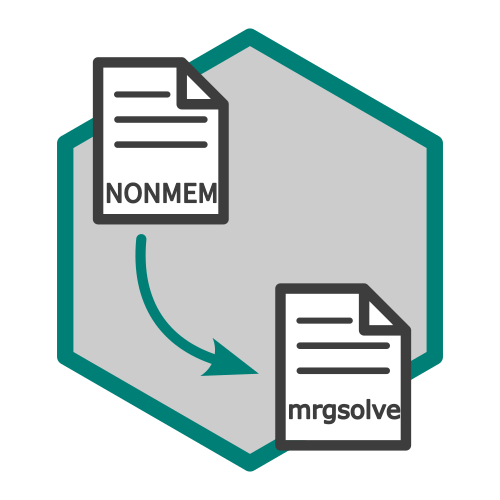

# NONMEM to mrgsolve model converter



This package provides a function to convert NONMEM model files (.mod) to mrgsolve model files (.cpp). It reads the NONMEM model file and generates a corresponding mrgsolve model file, allowing for easy integration of NONMEM models into the mrgsolve framework.

## Install

``` r
pak::pak("RyotaJin/nm2mrg")
```

## Usage

The package assumes the following directory structure.

```         
root
├── run001.mod
├── run001.ext
├── run001.lst
└── ...
```

Assuming the working directory is in root, the following execution will output the converted text.

``` r
# Convert using mod file (using initial parameters)
mrg_model1 <- nm2mrg::nm2mrg(
  mod_name = "run001",
  dir = "root/"
)

# Convert using mod, ext and lst file (using final estimates)
mrg_model2 <- nm2mrg::nm2mrg(
  mod_name = "run001",
  dir = "root/",
  use_final = TRUE
)
```

To output as a text file, do the following.

``` r
cat(mrg_model1, file = "run001.cpp")
cat(mrg_model2, file = "run001_final.cpp")
```

You can also launch the Shiny application with the following functions.

``` r
run_nm2mrg()
```
